# Boxeh shaders

## Name
My initial motivation to create this shader was to implement DOF using the classic **Box** blur. Box blur is easy to implement, really fast and has a square kernel. 
When DOF is pressent, lights in the distance look like bubbles. This artifact is called "**Bokeh**". Since Box blur uses a square kernel, the Bokeh is in the shape of square. Which fits minecraft blocky nature very well.

Shortly: **Bokeh** + **Box** blur = **Boxeh**

## Goals

### 1. Efficiency

Choose only effects that have big impact on visualls but have low computing cost.

### 2. Realism

- reality dictates the value of each constant, no artistic input.
- technique should maximize realism without sacrificing efficiency.
- Limit effects to those observable by the human eye

For example the DOF effect uses focal length that matches the average human eye lens (~17mm). Or The Lens flare effect is not implemented since it is visible by camera lens only.

### 3. Customizability

Each effect can be turned on/off. For instance,this shader can be used to enhance water only. When all effects are disabled, the visuals and performance should resemble vanilla Minecraft. 

## Features

### Custom lighting

 | Vanilla  | Boxeh |
 | ------------- | ------------- |
 |  |  |
 | 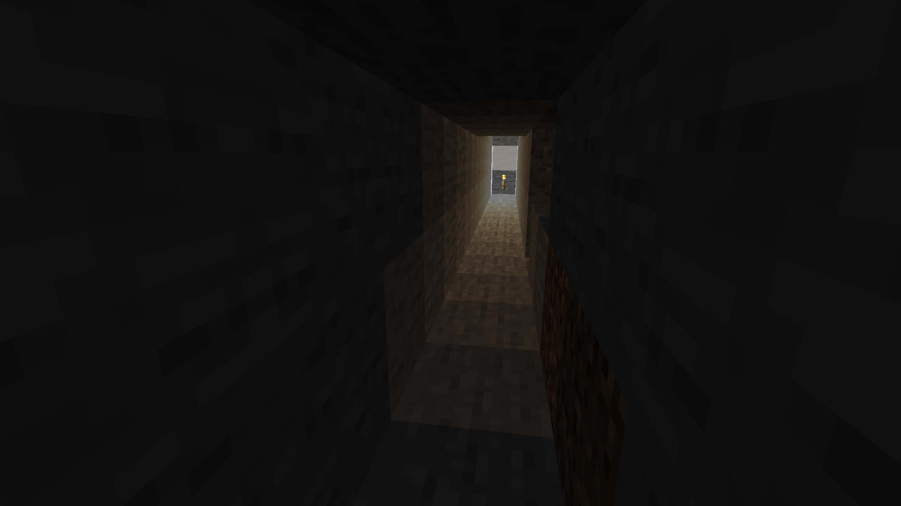 | 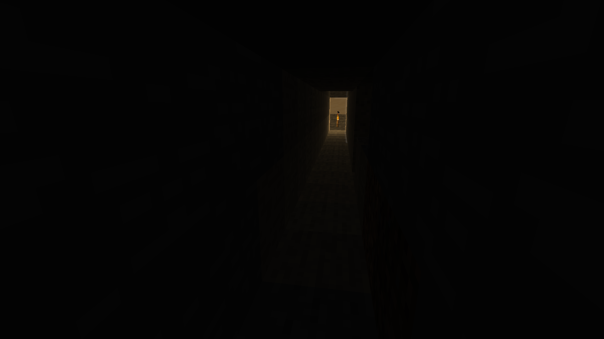 |

### Shadows

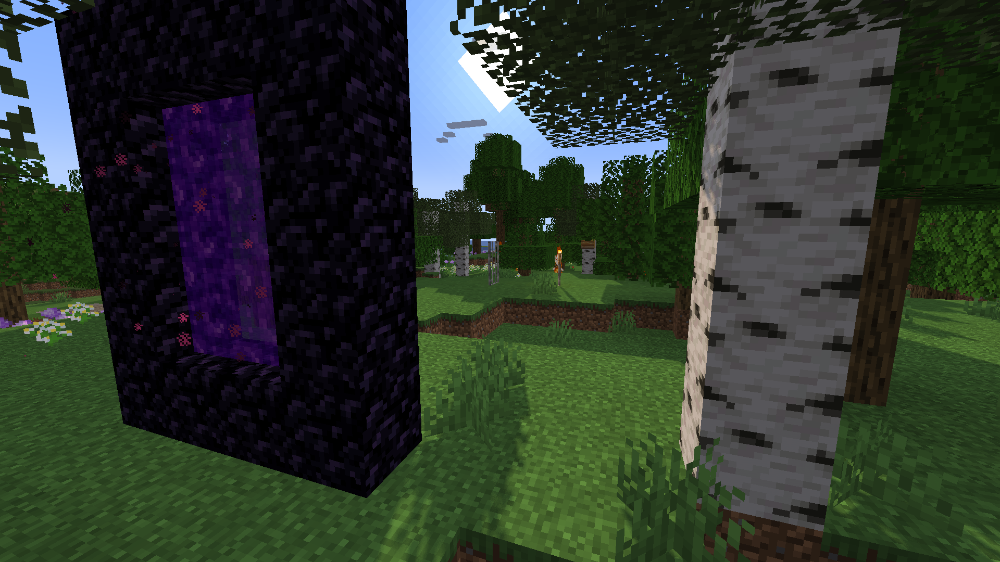

### Atmospheric Fog

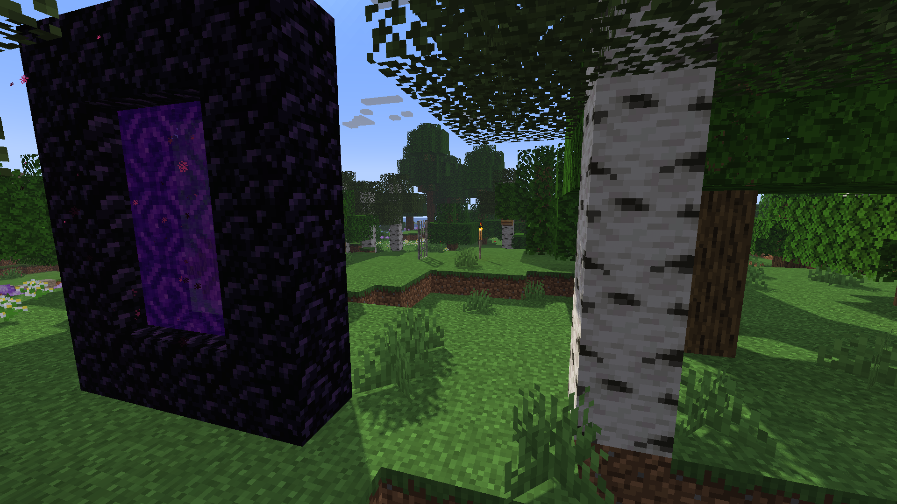

### Reflection

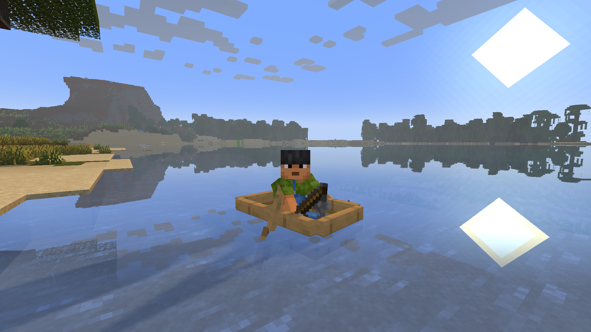

### Water texture opacity

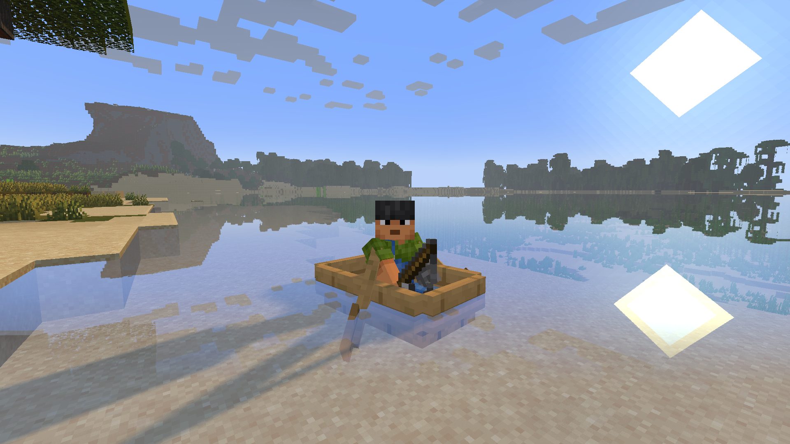

### Water Light Absorption (color)

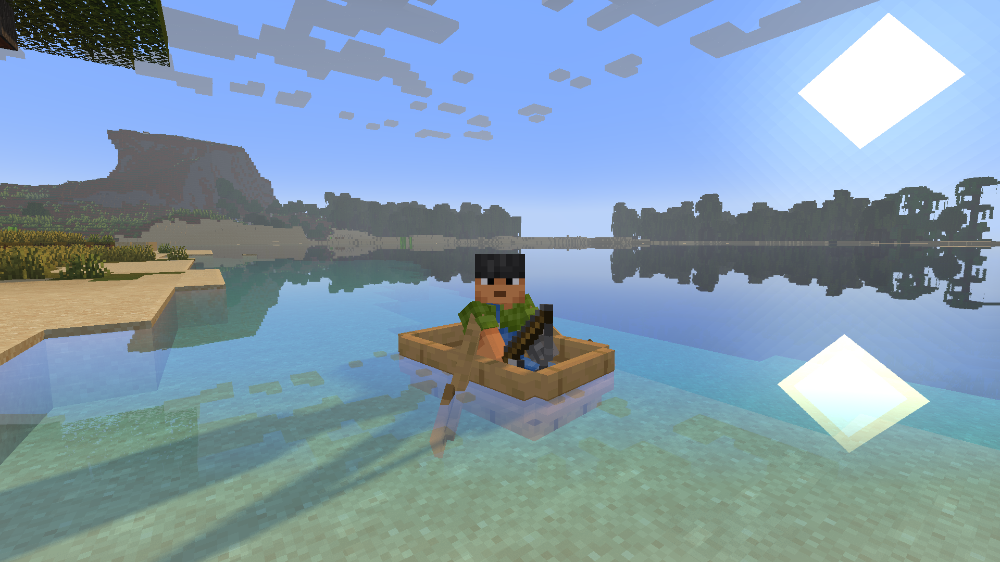

### Water Light Refraction

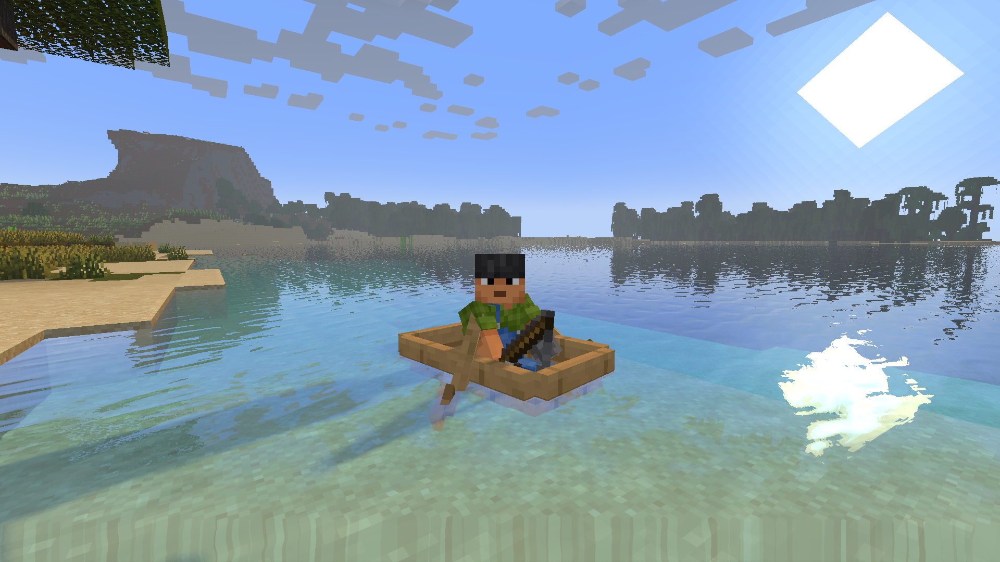

This effect is NOT faked. That is why you can see an artifact near the bottom edge of the screen. The shader can't draw what is not visible.

### Water surface waves

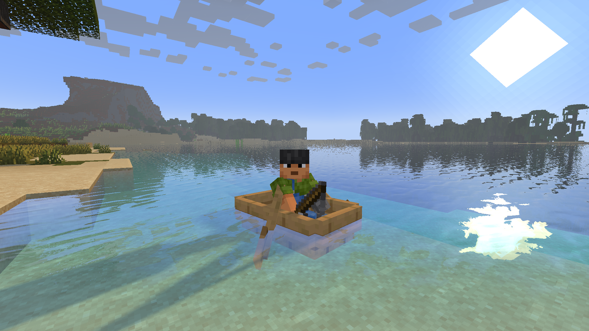

### Godrays (Sun lightrays)

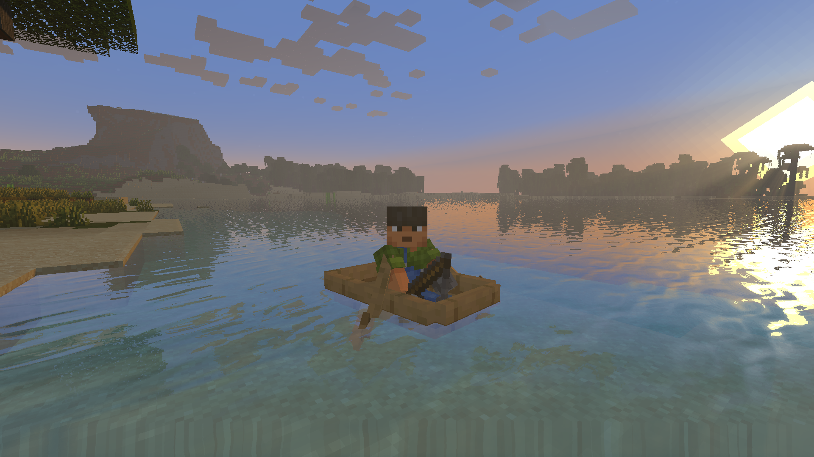

### Depth Of Field Blur

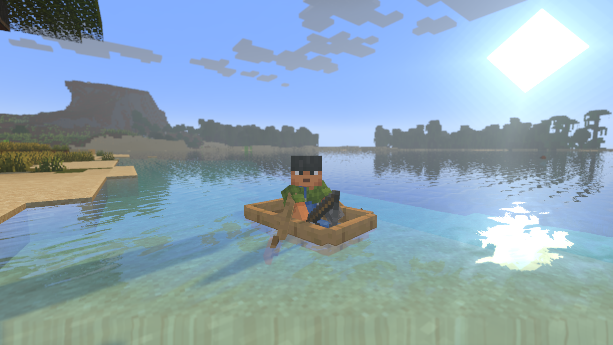

## Album
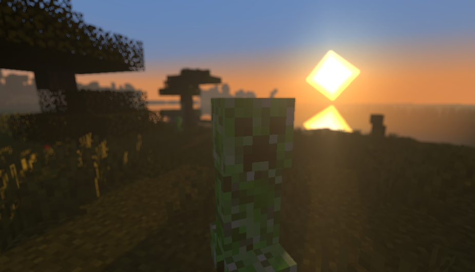
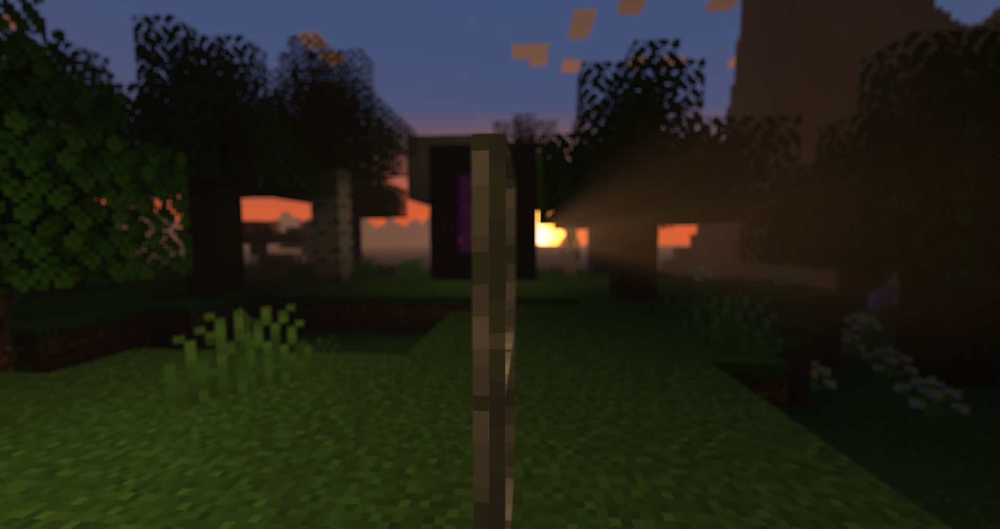
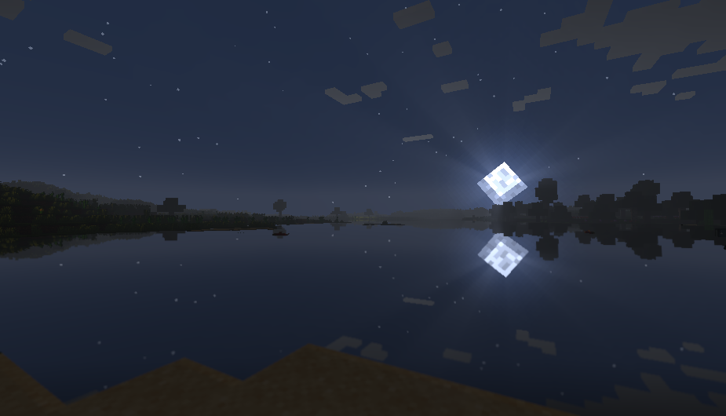
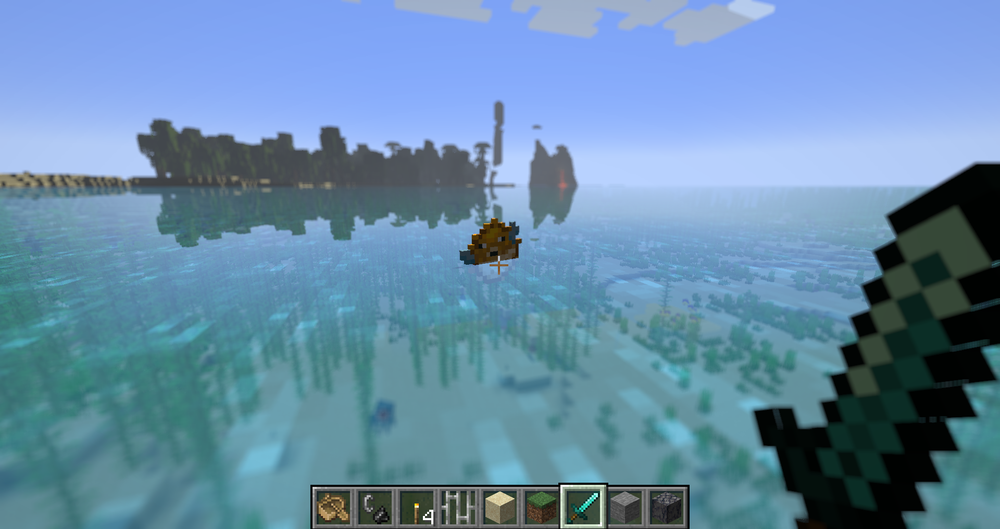
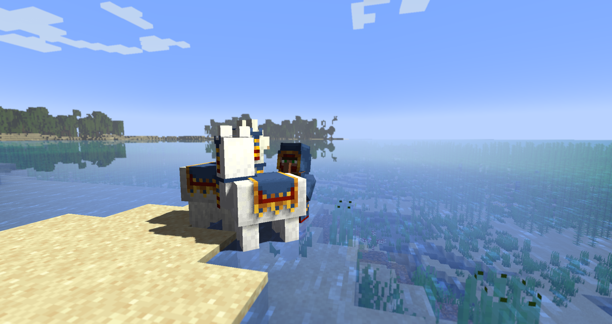
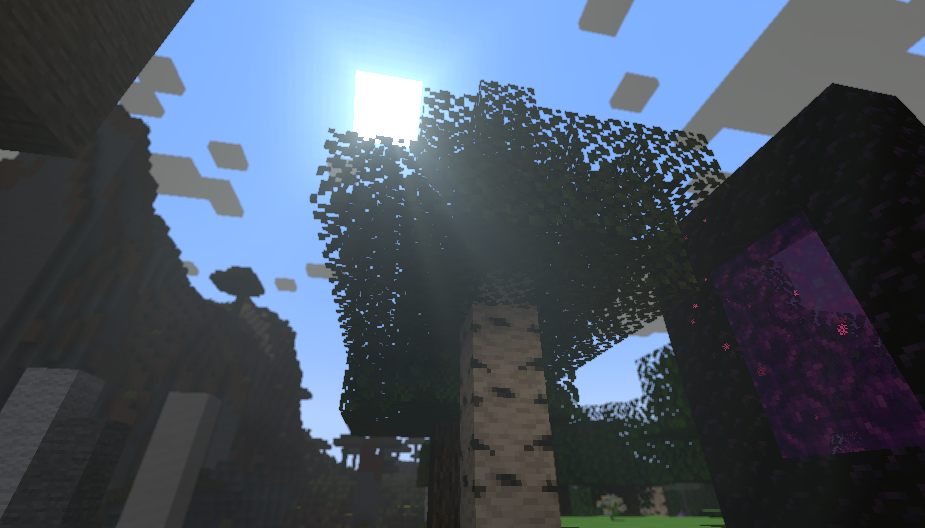